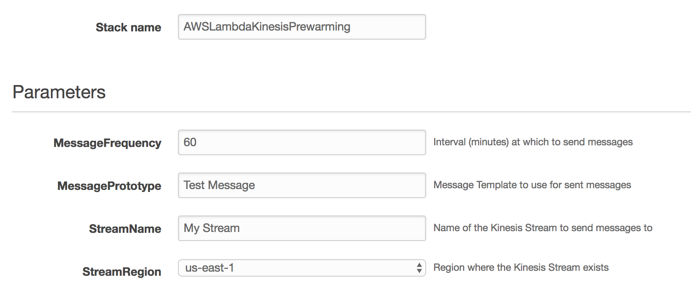

# AWS Lambda pre-warming for Amazon Kinesis

This project aims to give customers a simple ability to ensure that AWS Lambda functions are 'warm' and ready to process messages when they are received from Amazon Kinesis. When you create an AWS Lambda function with an Event Source which reads from Amazon Kinesis Streams, AWS Lambda will run up to 1 container per Shard in the Stream:


These containers will be kept running as long as there are messages to be processed on the Stream. During very quiet periods, where there are no messages being received, then the Lambda containers [may be shut down or frozen](https://aws.amazon.com/blogs/compute/container-reuse-in-lambda). Depending up on the implementation language, you may find that the first time a container has to start up, it will take some time to load your code modules, attach ENI's, and so on. While extremely rare, in some cases our customers have said that they have extremly low latency requirements for execution, and this potential for increased latency due to cold starts needs to be minimised. There are some best practices to limit the impact of cold starts when they do happen: keep your deployed Lambda modules as small as possible, consider using Node.js or Python rather than Java (which has to start a JVM and classload certain dependencies), and run outside of VPC if possible.

This module specifically focuses on those rare cases where we must do everything possible to limit the chances of Lambda containers being 'frozen' or stopped by periodically. We do this by sending 'canary' messages to the Stream, which will force AWS Lambda containers to stay running. However, given the mapping of Kinesis Shards to Lambda containers, we also ensure that canary messages are sent to every open Shard, which will then start a Lambda function container and ensure that real messages are less likely to observe cold start latency:


A few key points are needed to understand the workflow:

1. The function can be invoked via an Amazon CloudWatch Scheduled Event, an AWS API Gateway call, or any other mechanism you'd like. The function invocation can provide the following parameters:

    ``` 
    {
     "streamName": "MyStream",
     "regionName": "MyStreamRegion",
     "messagePrototype": "InputMessage"
    }
    ```

    where you provide the `streamName` to send messages to, in the `regionName` where the Stream has been created.
	
    `messagePrototype` is a special optional field that allows you to inject special characters that your down-stream processing functions will recognise and know that they shouldn't attempt to deserialise. If you don't provide a `messagePrototype`, then an empty-string message will be sent. The module will send messages every 60 minutes by default, but you can change the frequency when deploying.

2. The function connects to Amazon Kinesis in the specified region, and extracts all the currently open [Shards](http://docs.aws.amazon.com/streams/latest/dev/key-concepts.html) that are being used for processing.
3. The function pushes messages to the Stream using PutRecords. It ensurese that every Shard receives a message by setting the [ExplicitHashKey](http://docs.aws.amazon.com/kinesis/latest/APIReference/API_PutRecord.html) for the message to the Shard's starting hash value
4. The architecture of AWS Lambda for processing Kinesis Streams is to have a single Lambda container/processor per Shard. This is to ensure that messages will be strictly ordered over time. By sending a Kinesis message to each Shard, we will force Lambda to start a container to process the message, even if there is no other traffic naturally coming across the Stream.


Please note that a single function implementation can work across many [AWS Regions](http://docs.aws.amazon.com/general/latest/gr/rande.html) and can service a virtually unlimited number of Kinesis Streams.
    
## Getting Started

This functionality is provided via the [Serverless Application Model](https://github.com/awslabs/serverless-application-model), which enables you to deploy Lambda applications, with their associated event sources and permissions, via AWS CloudFormation. 

You can launch the SAM stack which sets up the utility using the following templates:

| |
| --------------------------|
| [](https://console.aws.amazon.com/cloudformation/home?region=ap-south-1#/stacks/new?stackName=AWSLambdaKinesisPrewarming&templateURL=https://s3-ap-south-1.amazonaws.com/awslabs-code-ap-south-1/KinesisLambdaPrewarming/deploy.yaml) in ap-south-1 |
| [](https://console.aws.amazon.com/cloudformation/home?region=eu-west-2#/stacks/new?stackName=AWSLambdaKinesisPrewarming&templateURL=https://s3-eu-west-2.amazonaws.com/awslabs-code-eu-west-2/KinesisLambdaPrewarming/deploy.yaml) in eu-west-2 |
| [](https://console.aws.amazon.com/cloudformation/home?region=eu-west-1#/stacks/new?stackName=AWSLambdaKinesisPrewarming&templateURL=https://s3-eu-west-1.amazonaws.com/awslabs-code-eu-west-1/KinesisLambdaPrewarming/deploy.yaml) in eu-west-1 |
| [](https://console.aws.amazon.com/cloudformation/home?region=ap-northeast-2#/stacks/new?stackName=AWSLambdaKinesisPrewarming&templateURL=https://s3-ap-northeast-2.amazonaws.com/awslabs-code-ap-northeast-2/KinesisLambdaPrewarming/deploy.yaml) in ap-northeast-2 |
| [](https://console.aws.amazon.com/cloudformation/home?region=ap-northeast-1#/stacks/new?stackName=AWSLambdaKinesisPrewarming&templateURL=https://s3-ap-northeast-1.amazonaws.com/awslabs-code-ap-northeast-1/KinesisLambdaPrewarming/deploy.yaml) in ap-northeast-1 |
| [](https://console.aws.amazon.com/cloudformation/home?region=sa-east-1#/stacks/new?stackName=AWSLambdaKinesisPrewarming&templateURL=https://s3-sa-east-1.amazonaws.com/awslabs-code-sa-east-1/KinesisLambdaPrewarming/deploy.yaml) in sa-east-1 |
| [](https://console.aws.amazon.com/cloudformation/home?region=ca-central-1#/stacks/new?stackName=AWSLambdaKinesisPrewarming&templateURL=https://s3-ca-central-1.amazonaws.com/awslabs-code-ca-central-1/KinesisLambdaPrewarming/deploy.yaml) in ca-central-1 |
| [](https://console.aws.amazon.com/cloudformation/home?region=ap-southeast-1#/stacks/new?stackName=AWSLambdaKinesisPrewarming&templateURL=https://s3-ap-southeast-1.amazonaws.com/awslabs-code-ap-southeast-1/KinesisLambdaPrewarming/deploy.yaml) in ap-southeast-1 |
| [](https://console.aws.amazon.com/cloudformation/home?region=ap-southeast-2#/stacks/new?stackName=AWSLambdaKinesisPrewarming&templateURL=https://s3-ap-southeast-2.amazonaws.com/awslabs-code-ap-southeast-2/KinesisLambdaPrewarming/deploy.yaml) in ap-southeast-2 |
| [](https://console.aws.amazon.com/cloudformation/home?region=eu-central-1#/stacks/new?stackName=AWSLambdaKinesisPrewarming&templateURL=https://s3-eu-central-1.amazonaws.com/awslabs-code-eu-central-1/KinesisLambdaPrewarming/deploy.yaml) in eu-central-1 |
| [](https://console.aws.amazon.com/cloudformation/home?region=us-east-1#/stacks/new?stackName=AWSLambdaKinesisPrewarming&templateURL=https://s3-us-east-1.amazonaws.com/awslabs-code-us-east-1/KinesisLambdaPrewarming/deploy.yaml) in us-east-1 |
| [](https://console.aws.amazon.com/cloudformation/home?region=us-east-2#/stacks/new?stackName=AWSLambdaKinesisPrewarming&templateURL=https://s3-us-east-2.amazonaws.com/awslabs-code-us-east-2/KinesisLambdaPrewarming/deploy.yaml) in us-east-2 |
| [](https://console.aws.amazon.com/cloudformation/home?region=us-west-1#/stacks/new?stackName=AWSLambdaKinesisPrewarming&templateURL=https://s3-us-west-1.amazonaws.com/awslabs-code-us-west-1/KinesisLambdaPrewarming/deploy.yaml) in us-west-1 |
| [](https://console.aws.amazon.com/cloudformation/home?region=us-west-2#/stacks/new?stackName=AWSLambdaKinesisPrewarming&templateURL=https://s3-us-west-2.amazonaws.com/awslabs-code-us-west-2/KinesisLambdaPrewarming/deploy.yaml) in us-west-2 |

This will load the template into the CloudFormation Web Console. Click 'Next' to go the the detail configuration:



The stack name has been preconfigured to a descriptive value, but you can change this should you wish to. Then add the Message Prototype text, the name of the Kinesis Stream, the AWS Region where the Stream is deployed, and the frequency, in minutes, that the module should send messages. Please note that this configuration can run across AWS Regions. Click 'Next' to go to the next screen:


You can add any relevant Tags, and then you MUST select an [AWS IAM Role which CloudFormation uses to modify AWS Resources on your behalf](http://docs.aws.amazon.com/AWSCloudFormation/latest/UserGuide/using-iam-servicerole.html). Click 'Next' to go to the review and validation pages. You will have to tick two boxes:


Which enable CloudFormation to create IAM resources on your behalf, in this case Permissions for CloudWatch to invoke the new Lambda function. Finally, the Serverless Application Model uses [CloudFormation Change Sets](http://docs.aws.amazon.com/AWSCloudFormation/latest/UserGuide/using-cfn-updating-stacks-changesets-create.html) to transform the provided deployment model to a full CloudFormation Stack. You'll need to enable the creation of a Change Set by selecting 'Create Change Set':


Once done, CloudFormation will give you a preview of the resources to be created:


Finally, click 'Execute' to build the CloudFormation stack. You'll see that the console shows the stack being created:


Once, done, you'll see you have a new Lambda function called "AWSLambdaKinesisPrewarming-ScheduledFunction-\<some guid>":


And a CloudWatch Scheduled Event Rule to invoke it every 15 minutes:


## Checking that the module is running

Once running, you can check the CloudWatch Logs for the Lambda function, which should show you detail about canary messages being sent:


## Making changes

You are very welcome to make changes to the module, and we're always keen to accept pull requests. If you do make changes to the codebase, you can then build a new version of the Lambda jar with `mvn package`, which will create a new deployable jar in the `./target` folder. It is reocmmended if you do this that you update the version number in the `pom.xml` so that your jar has a new version.

----

AWS Lambda Kinesis Prewarming

Copyright 2017-2017 Amazon.com, Inc. or its affiliates. All Rights Reserved.

This library is licensed under the Apache 2.0 License.